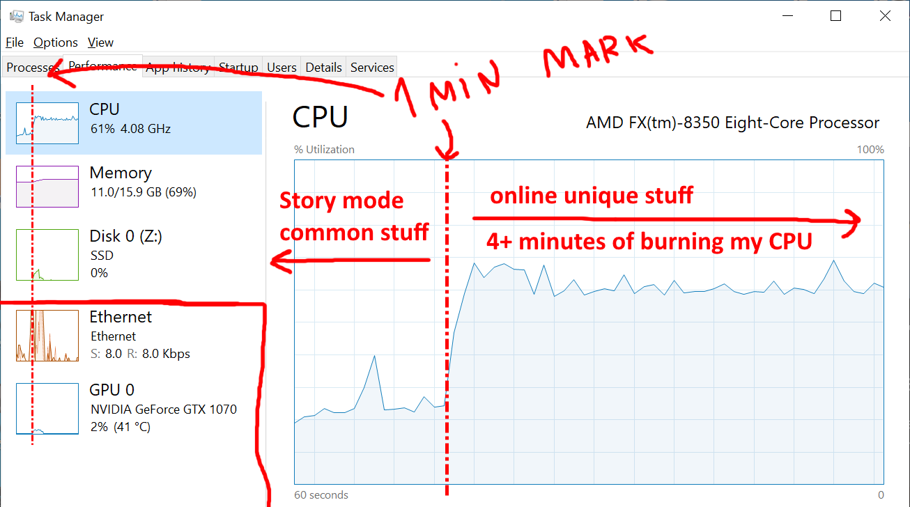

https://nee.lv/2021/02/28/How-I-cut-GTA-Online-loading-times-by-70/


How I cut GTA Online loading times by 70%
=====================
**t0st 2021-02-28**

GTA Online. Infamous for its slow loading times. Having picked up the game again to finish some of the newer heists I was shocked (/s) to discover that it still loads just as slow as the day it was released 7 years ago.

It was time. Time to get to the bottom of this.

Recon
-----

First I wanted to check if someone had already solved this problem. Most of the results I found pointed towards anecdata about how the game is so sophisticated that it needs to load so long, stories on how the p2p network architecture is rubbish (not saying that it isn’t), some elaborate ways of loading into story mode and a solo session after that and a couple of mods that allowed skipping the startup R* logo video. Some more reading told me we could save a whopping 10-30 seconds with these combined!

Meanwhile on my PC…

Benchmark
---------

```
1 Story mode load time:  ~1m 10s
2 Online mode load time: ~6m flat
3 Startup menu disabled, time from R* logo until in-game (social club login time isn't counted).
4
5 Old but decent CPU:   AMD FX-8350
6 Cheap-o SSD:          KINGSTON SA400S37120G
7 We have to have RAM:  2x Kingston 8192 MB (DDR3-1337) 99U5471
8 Good-ish GPU:         NVIDIA GeForce GTX 1070
```
	


I know my setup is dated but what on earth could take 6x longer to load into online mode? I couldn’t measure any difference using the story-to-online loading technique as others have found before me. Even if it did work the results would be down in the noise.

I Am (Not) Alone
----------------

If this poll is to be trusted then the issue is widespread enough to mildly annoy more than 80% of the player base. It’s been 7 years R*!


Looking around a bit to find who are the lucky ~20% that get sub 3 minute load times I came across a few benchmarks with high-end gaming PCs and an online mode load time of about 2 minutes. I would kill hack for a 2 minute load time! It does seem to be hardware-dependent but something doesn’t add up here…

How come their story mode still takes near a minute to load? (The M.2 one didn’t count the startup logos btw.) Also, loading story to online takes them only a minute more while I’m getting about five more. I know that their hardware specs are a lot better but surely not 5x better.

Highly accurate measurements
----------------

Armed with such powerful tools as the Task Manager I began to investigate what resources could be the bottleneck.




After taking a minute to load the common resources used for both story and online modes (which is near on par with high-end PCs) GTA decides to max out a single core on my machine for four minutes and do nothing else.

Disk usage? None! Network usage? There’s a bit, but it drops basically to zero after a few seconds (apart from loading the rotating info banners). GPU usage? Zero. Memory usage? Completely flat…

What, is it mining crypto or something? I smell code. Really bad code.
Single thread-bound

While my old AMD CPU has 8 cores and it does pack a punch, it was made in the olden days. Back when AMD’s single-thread performance was way behind Intel’s. This might not explain all of the load time differences but it should explain most of it.

What’s odd is that it’s using up just the CPU. I was expecting vast amounts of disk reads loading up resources or loads of network requests trying to negotiate a session in the p2p network. But this? This is probably a bug.
Profiling

Profilers are a great way of finding CPU bottlenecks. There’s only one problem - most of them rely on instrumenting the source code to get a perfect picture of what’s happening in the process. And I don’t have the source code. Nor do I need microsecond-perfect readings - I have 4 minutes’ worth of a bottleneck.

Enter stack sampling: for closed source applications there’s only one option. Dump the running process’ stack and current instruction pointer’s location to build a calling tree in set intervals. Then add them up to get statistics on what’s going on. There’s only one profiler that I know of (might be ignorant here) that can do this on Windows. And it hasn’t been updated in over 10 years. It’s Luke Stackwalker! Someone, please give this project some love :)

The power of statistics compels you!

Normally Luke would group the same functions together but since I don’t have debugging symbols I had to eyeball nearby addresses to guess if it’s the same place. And what do we see? Not one bottleneck but two of them!
Down the rabbit hole

Having borrowed my friend’s completely legitimate copy of the industry-standard disassembler (no, I really can’t afford the thing… gonna learn to ghidra one of these days) I went to take GTA apart.

Gibberish Galore

That doesn’t look right at all. Most high-profile games come with built-in protection against reverse engineering to keep away pirates, cheaters, and modders. Not that it has ever stopped them.

There seems to be some sort of an obfuscation/encryption at play here that has replaced most instructions with gibberish. Not to worry, we simply need to dump the game’s memory while it’s executing the part we want to look at. The instructions have to be de-obfuscated before running one way or another. I had Process Dump lying around, so I used that, but there are plenty of other tools available to do this sort of thing.
Problem one: It’s… strlen?!

Disassembling the now-less-obfuscated dump reveals that one of the addresses has a label pulled out of somewhere! It’s strlen? Going down the call stack the next one is labeled vscan_fn and after that the labels end, tho I’m fairly confident it’s sscanf.

A graph a day keeps the skeptics away

It’s parsing something. Parsing what? Untangling the disassembly would take forever so I decided to dump some samples from the running process using x64dbg. Some debug-stepping later it turns out it’s… JSON! They’re parsing JSON. A whopping 10 megabytes worth of JSON with some 63k item entries.

1
2
3
4
5
6
7
8
9
10
11

	

...,
{
    "key": "WP_WCT_TINT_21_t2_v9_n2",
    "price": 45000,
    "statName": "CHAR_KIT_FM_PURCHASE20",
    "storageType": "BITFIELD",
    "bitShift": 7,
    "bitSize": 1,
    "category": ["CATEGORY_WEAPON_MOD"]
},
...

What is it? It appears to be data for a “net shop catalog” according to some references. I assume it contains a list of all the possible items and upgrades you can buy in GTA Online.

Clearing up some confusion: I beleive these are in-game money purchasable items, not directly linked with microtransactions.

But 10 megs? That’s nothing! And using sscanf may not be optimal but surely it’s not that bad? Well…

Ouch!

Yeah, that’s gonna take a while… To be fair I had no idea most sscanf implementations called strlen so I can’t blame the developer who wrote this. I would assume it just scanned byte by byte and could stop on a NULL.
Problem two: Let’s use a Hash- … Array?

Turns out the second offender is called right next to the first one. They’re both even called in the same if statement as seen in this ugly decompilation:

Beggar thy neighbour

All labels are mine, no idea what the functions/parameters are actually called.

The second problem? Right after parsing an item, it’s stored in an array (or an inlined C++ list? not sure). Each entry looks something like this:

1
2
3
4

	

struct {
    uint64_t *hash;
    item_t   *item;
} entry;

But before it’s stored? It checks the entire array, one by one, comparing the hash of the item to see if it’s in the list or not. With ~63k entries that’s (n^2+n)/2 = (63000^2+63000)/2 = 1984531500 checks if my math is right. Most of them useless. You have unique hashes why not use a hash map.

Oof!

I named it hashmap while reversing but it’s clearly not_a_hashmap. And it gets even better. The hash-array-list-thing is empty before loading the JSON. And all of the items in the JSON are unique! They don’t even need to check if it’s in the list or not! They even have a function to directly insert the items! Just use that! Srsly, WAT!?
PoC

Now that’s nice and all, but no one is going to take me seriously unless I test this so I can write a clickbait title for the post.

The plan? Write a .dll, inject it in GTA, hook some functions, ???, profit.

The JSON problem is hairy, I can’t realistically replace their parser. Replacing sscanf with one that doesn’t depend on strlen would be more realistic. But there’s an even easier way.

    hook strlen
    wait for a long string
    “cache” the start and length of it
    if it’s called again within the string’s range, return cached value

Something like:

1
2
3
4
5
6
7
8
9
10
11
12
13
14
15
16
17
18
19
20
21
22
23
24
25
26
27
28
29
30
31
32
33
34
35
36

	

size_t strlen_cacher(char* str)
{
  static char* start;
  static char* end;
  size_t len;
  const size_t cap = 20000;

  // if we have a "cached" string and current pointer is within it
  if (start && str >= start && str <= end) {
    // calculate the new strlen
    len = end - str;

    // if we're near the end, unload self
    // we don't want to mess something else up
    if (len < cap / 2)
      MH_DisableHook((LPVOID)strlen_addr);

    // super-fast return!
    return len;
  }

  // count the actual length
  // we need at least one measurement of the large JSON
  // or normal strlen for other strings
  len = builtin_strlen(str);

  // if it was the really long string
  // save it's start and end addresses
  if (len > cap) {
    start = str;
    end = str + len;
  }

  // slow, boring return
  return len;
}

And as for the hash-array problem, it’s more straightforward - just skip the duplicate checks entirely and insert the items directly since we know the values are unique.

1
2
3
4
5
6
7
8
9
10
11
12
13
14
15
16
17
18
19
20
21

	

char __fastcall netcat_insert_dedupe_hooked(uint64_t catalog, uint64_t* key, uint64_t* item)
{
  // didn't bother reversing the structure
  uint64_t not_a_hashmap = catalog + 88;

  // no idea what this does, but repeat what the original did
  if (!(*(uint8_t(__fastcall**)(uint64_t*))(*item + 48))(item))
    return 0;

  // insert directly
  netcat_insert_direct(not_a_hashmap, key, &item);

  // remove hooks when the last item's hash is hit
  // and unload the .dll, we are done here :)
  if (*key == 0x7FFFD6BE) {
    MH_DisableHook((LPVOID)netcat_insert_dedupe_addr);
    unload();
  }

  return 1;
}

Full source of PoC here.
Results

Well, did it work then?

1
2
3
4
5
6

	

Original online mode load time:        ~6m flat
Time with only duplication check patch: 4m 30s
Time with only JSON parser patch:       2m 50s
Time with both issues patched:          1m 50s

(6*60 - (1*60+50)) / (6*60) = 69.4% load time improvement (nice!)

Hell yes, it did! :))

Most likely, this won’t solve everyone’s load times - there might be other bottlenecks on different systems, but it’s such a gaping hole that I have no idea how R* has missed it all these years.
tl;dr

    There’s a single thread CPU bottleneck while starting up GTA Online
    It turns out GTA struggles to parse a 10MB JSON file
    The JSON parser itself is poorly built / naive and
    After parsing there’s a slow item de-duplication routine

R* please fix

If this somehow reaches Rockstar: the problems shouldn’t take more than a day for a single dev to solve. Please do something about it :<

You could either switch to a hashmap for the de-duplication or completely skip it on startup as a faster fix. For the JSON parser - just swap out the library for a more performant one. I don’t think there’s any easier way out.

ty <3
Small update

I was expecting to get some attention but nowhere near this much! After reaching the top of HN this post has spread like wildfire! Thank you for the overwhelming response :)

I’ll do more writing if something interesting comes along, but don’t expect anything of this scale soon - there was a lot of luck involved.

A few people suggested spamming this post to Rockstar’s support - please don’t! I’m sure they’ve seen this by now. Continuing would only bog down support tickets for everyone else. Social media is fair game in my book tho.

Several HN comments suggested I add a donate button, as they would like to buy me a beer (thank you!) so I’m placing a link in the footer.

Thank you for reading and all the support :)
Update 2021-03-15

    Got confirmation from R* that this is getting a fix soon
    Just got awarded $10k through their H1 in-game bounty as an exception :)) (usually only for security issues)
    Trying to figure out what’s a W8 and how to fill it (lol)
    I did try asking for more technical details but they couldn’t say anything
    Will do another benchmark on my same old setup as soon as the update is out, I’m sure their engineers won’t disappoint :)

Update 2021-03-16

R* released the update! Downloaded it and got my first run results - same hardware, same measurement - from R* logo to fully online.

upload successful

Fully fixed! t0st approves!

Thanks again for all the coffees, and thanks to R* for taking the time to look into this and the generous bounty!
